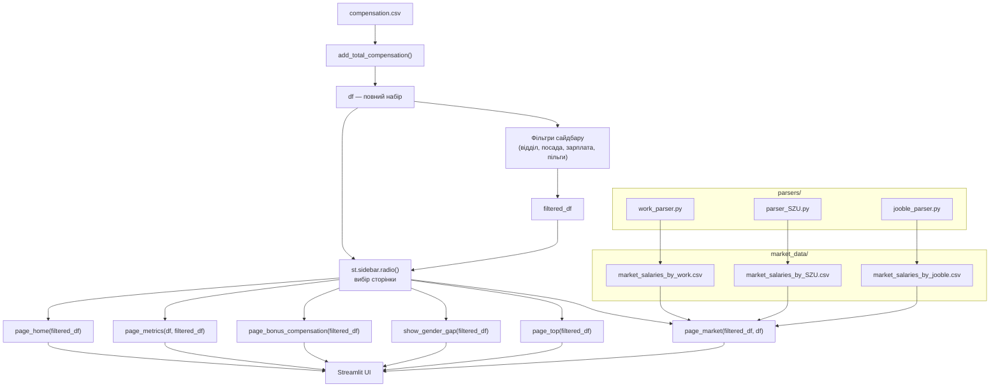
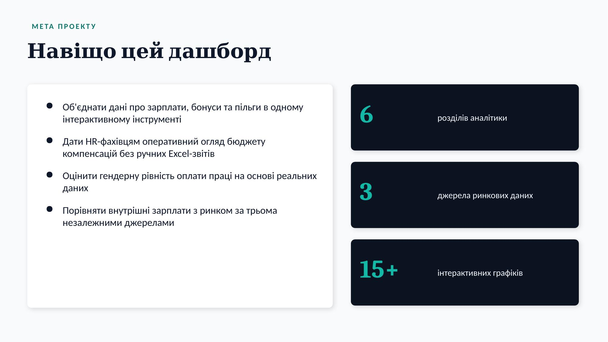
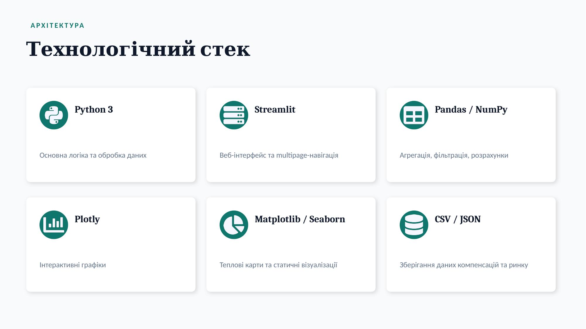
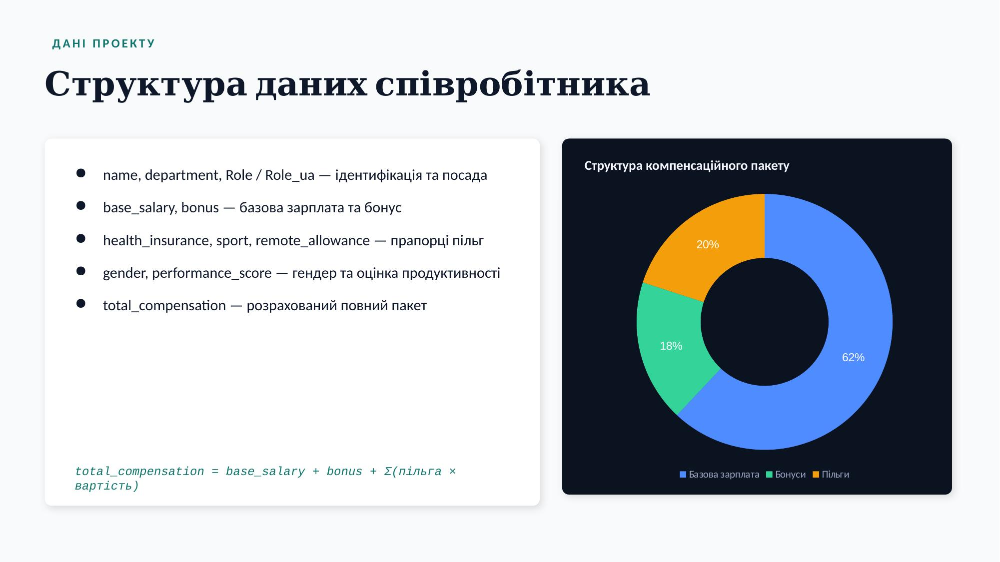
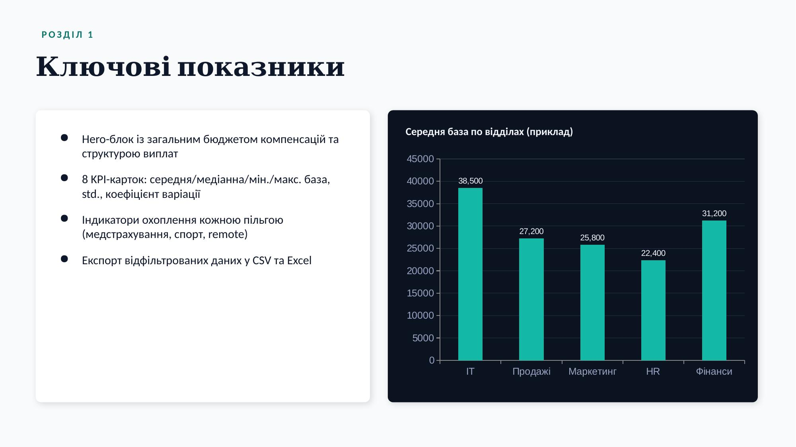
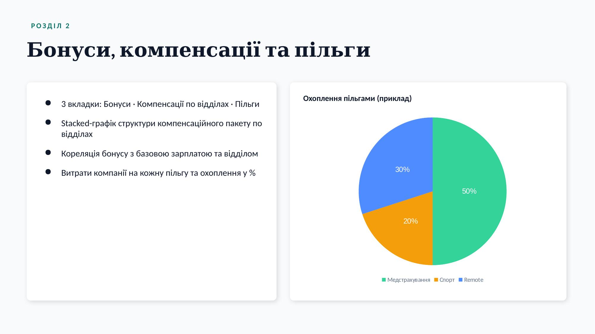
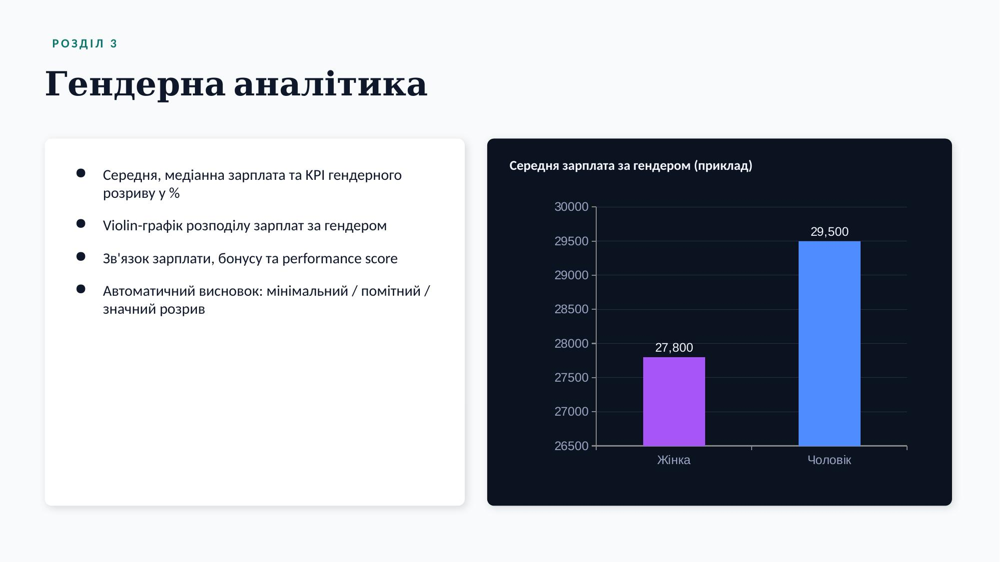
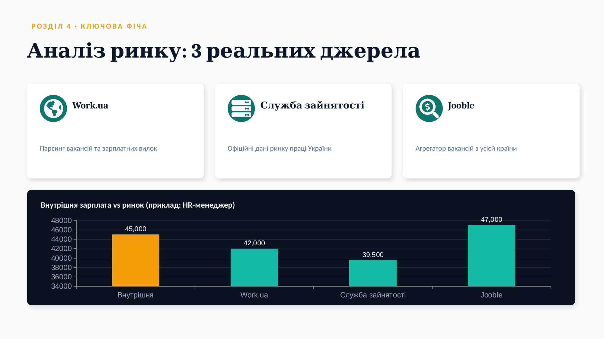

# 🏢 HR Analytics Dashboard – Compensation & Benefits

Інтерактивний дашборд на **Streamlit** для аналізу зарплат, бонусів, пільг та компенсаційних пакетів співробітників компанії. Дозволяє оцінити конкурентоспроможність оплати праці, гендерну рівність та структуру витрат на персонал — з порівнянням до **реальних ринкових даних**, спарсених з трьох джерел.

## 📋 Розділи дашборду

| Сторінка | Опис |
|---|---|
| 🏠 Головна | Загальний огляд компанії, структура відділів |
| 📊 Ключові показники | Бюджет компенсацій, KPI зарплат, охоплення пільгами |
| 🎁 Бонуси та компенсації | Бонусні програми, структура пакету, використання пільг |
| 👩‍💼 Гендерна аналітика | Гендерний розрив у зарплатах, бонусах, продуктивності |
| 🏆 Рейтинг співробітників | ТОП співробітників за повним компенсаційним пакетом |
| 📑 Аналіз ринку | Порівняння внутрішніх зарплат з ринком — Work.ua, Служба зайнятості, Jooble |

## 🗂 Структура проекту

```
Проект/
├── app.py                          # єдина точка входу: дані, фільтри, маршрутизація, всі сторінки
├── compensation.csv                 # основний набір даних співробітників
├── requirements.txt
├── README.md
├── HR_Analytics_Dashboard.pptx       # презентація для захисту
├── .gitignore
│
├── market_data/                      # реальні ринкові дані (результат парсингу)
│   ├── market_salaries_by_work.csv
│   ├── market_salaries_by_SZU.csv
│   └── market_salaries_by_jooble.csv
│
├── parsers/                           # скрипти збору ринкових даних
│   ├── work_parser.py                  # → market_salaries_by_work.csv
│   ├── parser_SZU.py                   # → market_salaries_by_SZU.csv
│   └── jooble_parser.py                # → market_salaries_by_jooble.csv
│
└── scripts/                           # підготовка тестових/допоміжних даних (не потрібні для запуску)
    ├── generate_compensation_200.py
    └── prepare_roles.py
```

> **Примітка:** проект не використовує нативну Streamlit-папку `pages/`. Усі сторінки — це окремі функції всередині `app.py` (`page_home`, `page_metrics`, `page_bonus_compensation`, `show_gender_gap`, `page_top`, `page_market`), а перемикання між ними відбувається через `st.sidebar.radio`. Детальніше — у розділі «Архітектура» нижче.

## ⚙️ Встановлення

```
cd Проект
python -m venv venv
venv\Scripts\activate      # Windows
pip install -r requirements.txt
```

### 📦 Залежності (`requirements.txt`)

```
streamlit
pandas
numpy
plotly
matplotlib
seaborn
openpyxl
```

## ▶️ Запуск

```
streamlit run app.py
```

Додаток відкриється у браузері за адресою `http://localhost:8501`.

## 🏗 Архітектура

Проект побудований як **один файл `app.py`** з внутрішньою маршрутизацією — без нативної multipage-структури Streamlit. Дані проходять два незалежні потоки, які з'єднуються лише на сторінці «Аналіз ринку».



**Як це працює:**

1. **Збір ринкових даних** (офлайн, заздалегідь) — `work_parser.py`, `parser_SZU.py`, `jooble_parser.py` парсять кожен своє джерело і зберігають результат у `market_data/` як окремий CSV з колонками `Role_ua`, `Average_Market_Salary_UAH`, `Last_Updated`.
2. **Запуск додатку** — `app.py` зчитує `compensation.csv`, рахує `total_compensation` через `add_total_compensation()` → отримуємо повний `df`.
3. **Фільтрація** — сайдбар будує `filtered_df` з `df` на основі вибраних відділів, посад, діапазону зарплати та пільг.
4. **Маршрутизація** — `st.sidebar.radio()` визначає, яку функцію-сторінку викликати. **Важливо:** не всі сторінки отримують однаковий набір даних:
   - `page_home`, `page_bonus_compensation`, `show_gender_gap`, `page_top` — лише `filtered_df`;
   - `page_metrics(df, filtered_df)` і `page_market(filtered_df, df)` — отримують **і повний `df`, і `filtered_df`** одночасно (повний — для розрахунку загальних показників/списку всіх посад, відфільтрований — для відображення вибірки).
5. **Ринкове порівняння** — `page_market()` додатково підвантажує потрібний CSV з `market_data/` залежно від обраного джерела (Work.ua / СЗУ / Jooble) і будує порівняння внутрішніх даних з ринковими.

## 📊 Дані співробітників

| Колонка | Опис |
|---|---|
| `id`, `employee_id` | ідентифікатор співробітника |
| `name` | ім'я |
| `department` | відділ |
| `Role`, `Role_ua` | посада (EN/UA) |
| `base_salary` | базова зарплата |
| `bonus` | бонус |
| `health_insurance`, `sport`, `remote_allowance` | прапорці пільг (0/1) |
| `gender` | стать |
| `performance_score` | оцінка продуктивності |

```
total_compensation = base_salary + bonus
                    + health_insurance × 5000
                    + sport × 2000
                    + remote_allowance × 3000
```

## 📑 Ринкові дані (`market_data/`)

| Джерело | Файл | Скрипт |
|---|---|---|
| Work.ua | `market_salaries_by_work.csv` | `parsers/work_parser.py` |
| Служба зайнятості України | `market_salaries_by_SZU.csv` | `parsers/parser_SZU.py` |
| Jooble | `market_salaries_by_jooble.csv` | `parsers/jooble_parser.py` |

На сторінці «Аналіз ринку» користувач обирає джерело через перемикач і бачить: gauge-індекс конкурентоспроможності, порівняння внутрішньої зарплати з ринком, відхилення по всіх посадах та порівняння всіх трьох джерел для обраної посади.

## 🛠 Технології

- **Streamlit** — веб-інтерфейс
- **Pandas / NumPy** — обробка даних
- **Plotly** — інтерактивні графіки (gauge, bar, scatter, violin, histogram, pie)
- **Matplotlib / Seaborn** — теплові карти

## 🎤 Презентація

`HR_Analytics_Dashboard.pptx` — презентація проекту для захисту.

### Превью слайдів

| | |
|---|---|
|  |  |
|  |  |
|  |  |
|  |  |
|  |  |
|  | |

## 👤 Автор

Навчальний проект з аналітики HR-даних, включно з власноруч зібраними ринковими даними з трьох публічних джерел.
